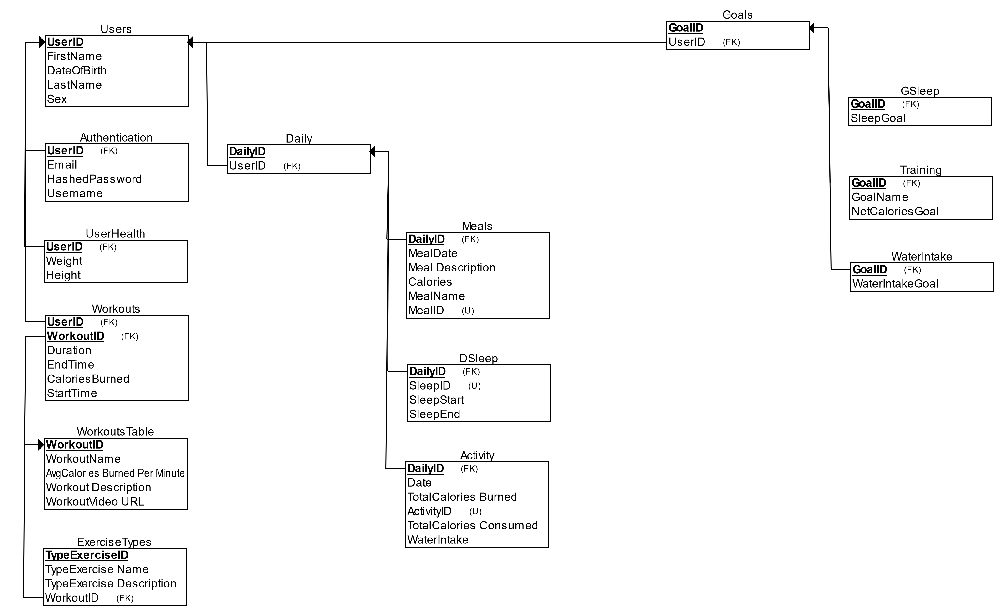
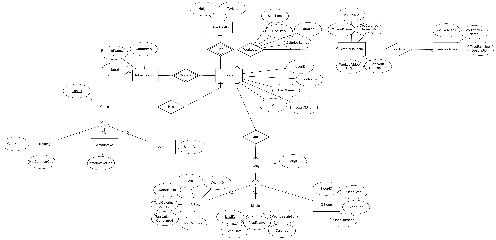

# Health and Fitness Apps Database

Welcome to the Health and Fitness Apps Database project! This repository contains a database for managing health and fitness-related data. The database is provided in SQL Server backup (.bak) format.

## Database File
- [HealthandFitnessTrackingApp.bak](HealthandFitnessTrackingApp.bak): The SQL Server backup file for the database.

## Schema Mapping

This image illustrates the schema mapping of the database. It provides an overview of the tables, relationships, and their connections.

## Entity-Relationship Diagram (EER)

The Entity-Relationship Diagram (EER) visualizes the entities and their relationships within the database. It is a helpful tool for understanding the structure and connections between different components.

## Getting Started

### Prerequisites
- SQL Server Management Studio (SSMS) or any other tool that supports .bak file restoration.

### Installation
1. Clone the repository to your local machine.
   ```bash
   git clone https://github.com/Samibltc/Health_And_Fitness_App_Database.git
   ```
2. Restore the database using SQL Server Management Studio or your preferred tool.
- Open SSMS and connect to your SQL Server.
- Right-click on the Databases folder and select "Restore Database."
- Choose the option to restore from a device and select the downloaded .bak file.

### Usage
- Utilize the database for storing and managing health and fitness-related data in your applications.
- Refer to the schema mapping and EER diagram for a better understanding of the database structure.

### Acknowledgments
Special thanks to contributors and anyone whose work has influenced this project.
Feel free to reach out if you have any questions or feedback. Happy coding!
